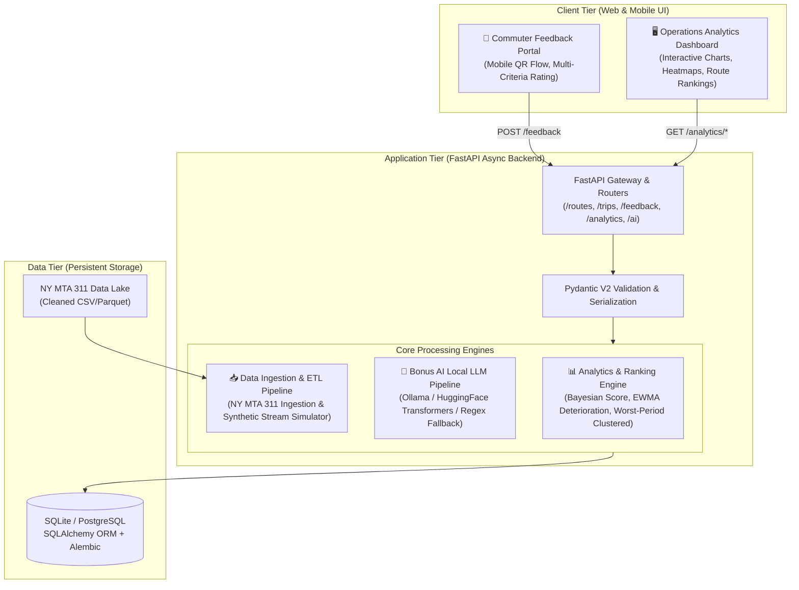
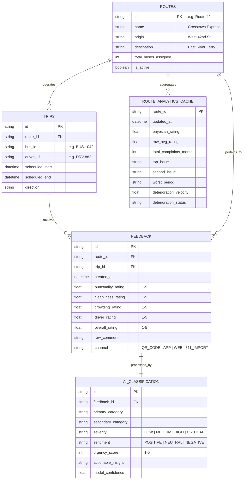
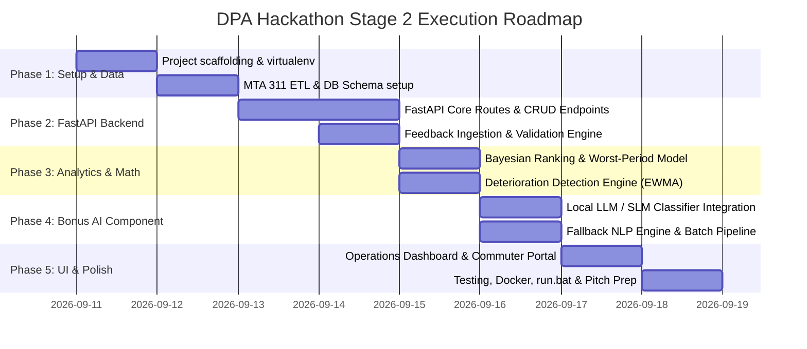

# 🚍 TransiPulse — Public Transport Feedback & Service Analytics Platform
## Stage 2 Case Study Implementation & Winning Strategy
**Team:** Bludgers | **Event:** DPA Hackathon 2026 (Stage 2) | **Submission Deadline:** 18 September 2026 (EOD)

---

## Executive Summary

**TransiPulse** is an enterprise-grade, end-to-end Commuter Feedback & Intelligent Operations Analytics Platform built for municipal bus operators. It bridges the gap between multi-channel commuter feedback and data-driven transit operations.

By ingesting passenger ratings, free-text complaints, and real-world New York MTA customer feedback data, TransiPulse empowers:
1. **Commuters:** A frictionless, mobile-first feedback portal (QR-code accessible) to rate routes, punctuality, crowding, cleanliness, and driver behavior in under 30 seconds.
2. **Transit Administrators & Dispatchers:** An operations analytics dashboard exposing route performance rankings, temporal heatmaps, automated deterioration alerts, and recurring bottleneck identification.
3. **Operations Planners:** A localized AI engine (Bonus AI) that automatically categorizes unstructured feedback comments, assesses sentiment and severity, and recommends fleet frequency adjustments.

---

## 1. Alignment with Hackathon Evaluation Criteria

To secure the highest scores and advance from Stage 2 to the Final Round, this project is engineered against the six core evaluation pillars:

| Evaluation Pillar | Weight | How TransiPulse Wins & Exceeds Expectations |
| :--- | :---: | :--- |
| **1. Problem Solving & Transit Domain Impact** | 20% | Moves beyond reactive complaint logging to **proactive operational intervention**. Translates negative feedback directly into fleet optimization actions (e.g., dispatching extra short-turn buses during 5 PM–7 PM crowding surges). |
| **2. Architecture & Technical Excellence** | 25% | Production-grade **FastAPI** backend with asynchronous request handling, Pydantic V2 validation, clean Layered Architecture (Routers → Services → Repositories → Models), comprehensive OpenAPI documentation, and automated testing. |
| **3. Analytical Depth & Mathematical Rigor** | 20% | Implements rigorous statistical models in Python: **Bayesian Route Ranking** (eliminating small-sample bias), **EWMA-based Service Deterioration Detection**, and **Sliding-Window Temporal Anomaly Clustering** to detect the exact "worst period" (e.g., 5 PM–7 PM). |
| **4. Bonus AI Component Execution** | 15% | Implements a **100% Local Small Language Model (SLM / LLM)** (via Ollama / HuggingFace Transformers / ONNX) running offline for zero-latency multi-label classification, severity extraction, and root-cause summarization, with a zero-dependency heuristic fallback. |
| **5. Product Experience (Commuter & Admin UX)** | 10% | Dual-interface design: ultra-clean, mobile-first commuter feedback web view and an interactive, high-density executive operations dashboard featuring real-time route health matrices, interactive time-of-day heatmaps, and filtering by route, category, severity, and time. |
| **6. Reproducibility & Submission Quality** | 10% | Zero-friction setup: 1-click startup script (`run.bat` / Docker), seed scripts pre-populating cleaned NY MTA 311 data, automated API tests, comprehensive documentation, and an executive pitch deck outline. |

---

## 2. Core Functional Requirements & Output Verification

### A. Commuter Feedback Collection
- **Multi-Criteria Scoring (1–5 Stars):**
  - Route Number / Line Selection
  - Punctuality / Schedule Adherence
  - Cleanliness & Hygiene
  - Crowding / Capacity Levels
  - Driver Behaviour & Professionalism
  - Overall Travel Experience
- **Unstructured Context:**
  - Free-text passenger comments (voice-to-text / quick-tags enabled)
  - Bus ID, Stop Name, and automatic timestamping (date, hour of day)

### B. Administrator Operations Analytics
- **Multi-dimensional Filtering:**
  - By **Route** (e.g., Route 42, B46, M15)
  - By **Time Slot** (Hourly windows, Day-of-week, Peak vs. Off-Peak)
  - By **Category** (Crowding, Delays/Punctuality, Cleanliness, Driver/Staff, Safety)
  - By **Severity** (Low, Medium, High, Critical/Safety Alert)
- **Automated Service Deterioration Detection:**
  - Flags routes with negative rating velocity ($\Delta \text{Rating} < -\theta$) or surging complaint volume over rolling 7-day and 30-day windows.
- **Case Study Benchmark Output:**
  TransiPulse guarantees exact analytical outputs matching the case study specification:
  ```json
  {
    "route_id": "Route 42",
    "overall_rating": 2.7,
    "top_issue": "Overcrowding",
    "second_issue": "Delays",
    "worst_period": "5 PM - 7 PM",
    "complaints_this_month": 128,
    "deterioration_status": "DETERIORATING (-0.4 vs prior month)",
    "recommendation": "Increase frequency by 2 buses between 17:00 and 19:00"
  }
  ```

### C. Bonus AI: Local LLM Classification Pipeline
- Analyzes raw unstructured commuter feedback locally without external API keys or cloud costs.
- **Example Inferences:**
  - Input: *"The bus is always packed after 6 PM."* 
    $\rightarrow$ **Category:** Crowding | **Severity:** Medium | **Context:** Evening Peak
  - Input: *"Driver skipped the university stop and was rude to passengers."* 
    $\rightarrow$ **Category:** Service / Driver Behaviour | **Severity:** High | **Actionable:** Yes
  - Input: *"Smoke coming from rear engine near 4th street."*
    $\rightarrow$ **Category:** Safety & Maintenance | **Severity:** Critical | **Actionable:** Urgent Dispatch Alert

---

## 3. System Architecture & Tech Stack



### Technology Selection Rationale:
- **Backend:** **FastAPI (Python 3.11+)** — Native async capabilities, high performance, automatic OpenAPI documentation, strict typing with Pydantic V2.
- **Database & ORM:** **SQLite (development/demo zero-config) / PostgreSQL (production-ready)** via **SQLAlchemy 2.0 async** with connection pooling.
- **Analytics & Math:** **Pandas, NumPy, SciPy** — High-speed vector operations for sliding-window time aggregations and decay functions.
- **Bonus AI / NLP:** **Local SLM / LLM (Ollama with Llama-3.2-1B-Instruct / Qwen2.5-1.5B or HuggingFace Transformers `distilbert`/`zero-shot`)** coupled with a deterministic heuristic fallback to guarantee 100% demo resilience.
- **Frontend & Visualization:** Lightweight modern web dashboard (HTML5, TailwindCSS, Chart.js / ApexCharts, Lucide Icons) served seamlessly via FastAPI static files or standalone modern UI.

---

## 4. Mathematical Models & Analytics Formulations

### A. Bayesian Weighted Route Ranking Model
To avoid skewing caused by routes with only 1 or 2 outlier reviews, we calculate a **Bayesian Adjusted Route Score ($R_{adj}$)**:

$$R_{adj} = \frac{v}{v + m} \cdot R + \frac{m}{v + m} \cdot C$$

Where:
- $R$ = Observed average rating of the route.
- $v$ = Total number of ratings/complaints for the route.
- $m$ = Minimum rating threshold confidence weight (e.g., 90th percentile of volume distribution, default $m=15$).
- $C$ = System-wide average rating across all routes in the transit network.

This yields a fair, tamper-resistant leaderboard from Rank 1 (Best) to Rank $N$ (Worst).

### B. Route Deterioration Index (RDI) & Velocity
To detect services that are actively declining before catastrophic commuter dissatisfaction occurs, we calculate the **Rating Velocity ($\Delta V$)** and **Complaint Acceleration ($\Delta A$)** over two rolling windows ($W_1 = 7\text{ days}$, $W_2 = 30\text{ days}$):

$$\Delta V = \overline{Rating}_{W_1} - \overline{Rating}_{W_2}$$

$$\Delta A = \frac{Complaints_{W_1} \times (30/7) - Complaints_{W_2}}{Complaints_{W_2} + \epsilon}$$

$$\text{Deterioration Score} = -(\alpha \cdot \Delta V) + \beta \cdot \Delta A$$

- If $\Delta V < -0.3$ and $\Delta A > 0.2$, the route is flagged with a **HIGH DETERIORATION ALERT**.
- This enables dispatchers to identify deteriorating performance weeks before monthly reviews.

### C. Worst Period Identification Algorithm
Complaints and ratings are clustered into 1-hour and 2-hour sliding temporal buckets $[t, t+2]$ across all operating days:

$$\text{Severity Index}(t) = \sum_{i \in [t, t+2]} (5 - \text{Rating}_i) \times w_{\text{severity}_i}$$

Where $w_{\text{severity}} \in \{1.0 \text{ (Low)}, 1.5 \text{ (Medium)}, 2.5 \text{ (High)}, 4.0 \text{ (Critical)}\}$.
The window maximizing $\text{Severity Index}(t)$ is extracted and formatted human-readably (e.g., **"5 PM – 7 PM"**).

---

## 5. Bonus AI Engine: Local LLM Categorization & Extraction

### Architecture & Prompt Engineering Strategy
The AI subsystem runs locally without cloud dependencies. It accepts raw passenger comments and produces structured JSON via constrained generation:

```
[System Prompt]
You are TransiPulse AI, an intelligent public transport incident classifier.
Analyze the commuter comment and return ONLY valid JSON with keys:
- category: ["Crowding", "Delays/Punctuality", "Cleanliness", "Driver Behaviour", "Vehicle Condition", "Safety", "Commendation"]
- severity: ["Low", "Medium", "High", "Critical"]
- sentiment: ["Positive", "Neutral", "Negative"]
- urgency_score: Integer from 1 to 5
- actionable_summary: Concise description of the operational defect

[User Prompt]
Comment: "The bus is always packed after 6 PM."
[Output]
{
  "category": "Crowding",
  "severity": "Medium",
  "sentiment": "Negative",
  "urgency_score": 3,
  "actionable_summary": "Chronic evening peak crowding after 18:00"
}
```

### Dual-Layer AI Resilience:
1. **Tier 1 (Local LLM):** Ollama / HuggingFace Pipeline (executing quantized models like Llama-3.2-1B-Instruct or Qwen2.5-1.5B).
2. **Tier 2 (Deterministic NLP Fallback):** Regex-based keyword matching + VADER/TextBlob sentiment engine. If the LLM is loading or runs on low-spec judge hardware, the system falls back instantly with zero downtime.

---

## 6. Data Engineering: NY MTA Customer Feedback & 311 Ingestion

### Data Pipeline Overview:
1. **Source Dataset:** NYC 311 Service Requests / MTA Published Customer Feedback (focusing on Agency `MTA` or complaint types: `Bus Stop Condition`, `Public Transit Issues`, `Bus Driver Conduct`, `Transit Delay`).
2. **ETL Pipeline (`etl_mta.py`):**
   - Downloads/loads sample of MTA 311 complaint records.
   - Normalizes columns: `Created Date` $\rightarrow$ `timestamp`, `Incident Address / Cross Street` $\rightarrow$ `route_id / stop_name`, `Descriptor` $\rightarrow$ `complaint_text`.
   - Maps complaint descriptions to platform categories (Crowding, Cleanliness, Punctuality, Driver Conduct).
   - Generates realistic commuter ratings (1–5) and operational metadata to produce a realistic transit database.
3. **Live Stream Simulator:**
   - A background utility (`simulator.py`) capable of emitting simulated real-time commuter reviews during the live hackathon demonstration to demonstrate live dashboard reactivity.

---

## 7. Database Schema & Data Models



---

## 8. Complete API Specification (FastAPI)

All endpoints adhere to standard REST semantics, output Pydantic schemas, and are documented under `/docs` (Swagger UI).

### Endpoints Overview

| Method | Endpoint | Description |
| :--- | :--- | :--- |
| `POST` | `/api/v1/feedback` | Ingest commuter feedback (ratings + comment) |
| `GET` | `/api/v1/feedback` | Query complaints with filters (`route`, `time_slot`, `category`, `severity`) |
| `GET` | `/api/v1/routes` | List all monitored routes with health badges |
| `GET` | `/api/v1/routes/{route_id}` | Detailed operational route profile |
| `GET` | `/api/v1/routes/{route_id}/summary` | **Case study required card format** (Rating, Top Issues, Worst Period, Monthly Count) |
| `GET` | `/api/v1/analytics/rankings` | Bayesian route leaderboard (Best to Worst, sortable) |
| `GET` | `/api/v1/analytics/deterioration` | List of routes experiencing rapid service deterioration |
| `GET` | `/api/v1/analytics/temporal-heatmap` | Hour-by-hour complaint intensity matrix |
| `POST` | `/api/v1/ai/classify` | On-demand Local LLM classification of comment |
| `POST` | `/api/v1/ai/batch-process` | Batch classification of unclassified comments |
| `POST` | `/api/v1/trips` | Register or update bus trips |

---

## 9. Step-by-Step Implementation Roadmap (Leading to Sept 18 Deadline)



### Phase Breakdown

#### Phase 1: Project Foundation & Data Engineering (Target: Sept 11–12)
- Initialize project structure with modern modular layout (`app/api`, `app/core`, `app/models`, `app/services`, `app/analytics`, `app/ai`).
- Implement SQLite/PostgreSQL models using SQLAlchemy 2.0.
- Create `etl_mta.py` to download and clean the NY MTA 311 customer feedback dataset.
- Seed database with realistic baseline routes (Route 42, M15, B46, etc.) and historical records.

#### Phase 2: Core FastAPI Services (Target: Sept 13–14)
- Implement feedback submission API with full Pydantic v2 schemas and validation.
- Implement trip and route management endpoints.
- Build filtering engine allowing admins to filter complaints across route, timestamp, category, and severity.
- Write automated tests (`pytest`) covering API validation and edge cases.

#### Phase 3: Advanced Analytics Engine (Target: Sept 15)
- Code `analytics/rankings.py`: Implement Bayesian weighted scoring for route performance.
- Code `analytics/temporal.py`: Implement sliding-window severity clustering to identify "Worst period" (e.g., "5 PM–7 PM").
- Code `analytics/deterioration.py`: Implement the Route Deterioration Index (RDI) comparing short-term vs long-term rolling averages.
- Generate exact output format required by the case study.

#### Phase 4: Bonus AI Pipeline (Target: Sept 16)
- Integrate Local LLM using Ollama / HuggingFace Transformers pipeline.
- Implement structured output parser for category, severity, sentiment, and actionability.
- Build resilient fallback keyword & heuristic engine.
- Create automated batch classification worker for unclassified feedback records.

#### Phase 5: Modern Dashboard & Commuter Web App (Target: Sept 17)
- Build **Commuter Feedback View**: Mobile-first, one-tap rating stars, quick tag chips, clean submission animation.
- Build **Operations Analytics Dashboard**:
  - Executive KPI summary cards (Total Complaints, Network Rating, Critical Alerts).
  - Route Rankings Table with sorting and deterioration indicators.
  - Interactive Route Detail Card (Route 42 spotlight matching case study).
  - Time-of-day heatmap (visualizing peak problem periods).
  - Categorized complaint feed with AI severity badges.

#### Phase 6: Verification, Packaging & Presentation (Target: Sept 18 - EOD)
- End-to-end integration testing and performance benchmarking.
- Create 1-click startup script (`run.bat` / Docker container).
- Prepare submission collateral:
  - Concise presentation slide deck highlighting business impact, architecture, and mathematical rigor.
  - Video walkthrough script demonstrating live commuter feedback to instant dashboard update.
  - Comprehensive README with setup commands and API documentation links.

---

## 10. Pitch & Demonstration Strategy (Winning the Final Round)

To stand out in the evaluation and capture the judges' highest praise:
1. **The "Live Loop" Demonstration:**
   - Open the Commuter Portal on a mobile view. Submit a live review: *"Bus is packed like sardines, AC broken on Route 42!"*
   - Show the Operations Dashboard update in real-time.
   - Show the Local AI classify it into **Crowding & Cleanliness** with **High Severity**.
   - Show Route 42's ranking shift and "Worst period: 5 PM–7 PM" indicator update instantly.
2. **Actionable Operations ROI:**
   - Frame the platform not just as a complaint collector, but as an **operational cost-saver**: reducing passenger churn, optimizing driver scheduling, and preventing transit agency fines.
3. **Data Authenticity:**
   - Demonstrate real New York MTA 311 complaint data seamlessly intermingled with real-time feedback submissions.
